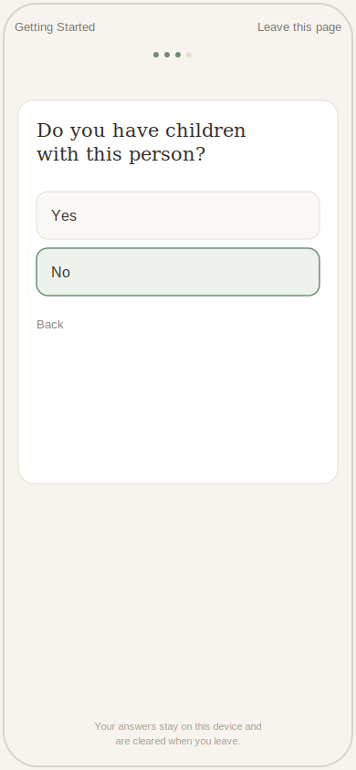

# TX Pro Se Protective Order Agent


An Azure-native AI agent that helps domestic violence survivors in Texas prepare a pro se application for a protective order — guided intake, statute-grounded procedural guidance, automated form completion, and hearing preparation support.

**⚠️ Scope:** This tool provides procedural guidance only. It is not a substitute for an attorney and does not give legal advice. See [Responsible AI & Scope](#responsible-ai--scope) below.

## Contents

- [Why this project](#why-this-project)
- [Screenshot](#screenshot)
- [Architecture](#architecture)
- [Key design decisions](#key-design-decisions)
- [Tech stack](#tech-stack)
- [Responsible AI & scope](#responsible-ai--scope)
- [Status](#status)
- [Local setup](#local-setup)
- [Documentation](#documentation)
- [Disclaimer](#disclaimer)

---

## Why this project

Built as an end-to-end demonstration of applied Azure AI engineering in a sensitive, high-stakes domain — where the interesting engineering problem isn't just "call an LLM," but deciding where AI assistance helps versus where it introduces real risk to a vulnerable user.

## Screenshot



Mobile-first intake flow — one question at a time, muted palette, no urgency-inducing progress counter, and a quick-exit link styled as ordinary navigation so it doesn't flag the tool on a shared or monitored device. Full interactive component: [`intake-mockup.jsx`](./intake-mockup.jsx).

## Architecture

See [`dv-protective-order-agent-architecture.md`](./dv-protective-order-agent-architecture.md) for the full design doc.

```
Intake (Container Apps)
   → Agent Orchestrator (Azure OpenAI)
   → RAG Retrieval (Azure AI Search: TX Family Code, county rules, form instructions)
   → Form Completion (Document Intelligence: parses uploaded supporting docs)
   → Filled PDF + Filing Instructions + Local Resources
   → Hearing Prep Guide + Chronology Worksheet

Cross-cutting: Key Vault (secrets) · Fabric (de-identified analytics)
```

## Key design decisions

These are the tradeoffs worth understanding, not just the tech list:

| Decision                                                    | Why                                                                                                                                                                                                                                   |
| ----------------------------------------------------------- | ------------------------------------------------------------------------------------------------------------------------------------------------------------------------------------------------------------------------------------- |
| RAG-grounded, not model-memory answers                      | Every procedural claim traces to TX statute/court-rule text — reduces hallucination risk on legal-adjacent content                                                                                                                    |
| Document Intelligence scoped to supporting-doc parsing only | The blank TX form is a single known template — a fixed field map is simpler and more reliable; DI earns its place on _uploaded_ documents, not everywhere                                                                             |
| No personalized hearing script                              | Generating case-specific testimony risks unauthorized-practice-of-law exposure and courtroom credibility issues; a generic guide + a worksheet that structures the survivor's _own_ words gets most of the benefit with far less risk |
| No Service Bus/Logic Apps in v1                             | Current scale doesn't justify async complexity; deferred until a real trigger (traffic spikes, slow processing steps, retry needs) exists                                                                                             |
| Managed identity over API keys                              | Container Apps' identity authenticates directly to OpenAI, AI Search, and Document Intelligence — no long-lived keys to leak, store, or rotate for core services                                                                      |
| Minimal data retention                                      | Intake data purged after form generation; no PII in logs                                                                                                                                                                              |

## Tech stack

- **AI/RAG:** Azure OpenAI, Azure AI Search
- **Document processing:** Azure Document Intelligence
- **App/infra:** Azure Container Apps, Azure Key Vault
- **Analytics:** Microsoft Fabric (de-identified only)
- **Backend:** Python, FastAPI
- **Deployment:** Docker

## Responsible AI & scope

- Provides procedural guidance only — never legal advice, case strategy, or outcome prediction
- All procedural answers are retrieval-grounded and traceable to official sources
- Escalates to legal aid / DV hotline resources for anything outside scope
- No personalized testimony generation (see design decisions above)
- Trauma-informed UI: quick-exit, minimal data retention, no forced history

## Status

**v1 (current):** intake → RAG guidance → form auto-fill → hearing prep guide + worksheet
**v2 considerations:** async/event-driven processing (if scale demands it), multi-county expansion beyond initial pilot counties

## Local setup

```bash
git clone <repo>
cd dv-protective-order-agent
pip install -r requirements.txt
cp .env.example .env  # fill in Azure resource endpoints/keys via Key Vault
uvicorn src.api.main:app --reload
```

Requires provisioned Azure OpenAI, AI Search, Document Intelligence, and Key Vault resources — see architecture doc [§8 "What You Need to Stand This Up"](./dv-protective-order-agent-architecture.md#8-what-you-need-to-stand-this-up). In Azure, auth to these resources uses managed identity; locally, `.env` supplies the same config (see `.env.example`).

## Documentation

- [Architecture Doc](./dv-protective-order-agent-architecture.md) — full system design, component breakdown, design-decision rationale
- [Data Indexing Plan](./data-indexing-plan.md) — how the RAG corpus (statutes, county rules, form instructions) is chunked, indexed, and kept current
- [RAG Index Schema](./rag-index-schema.json) — runnable Azure AI Search index definition
- [Intake Mockup](./intake-mockup.jsx) — interactive React component for the trauma-informed intake UI

## Disclaimer

This is a portfolio/demonstration project. It is not affiliated with any court, bar association, or legal aid organization, and has not undergone formal legal review. Do not use for an actual filing without consulting a licensed attorney or legal aid service.
